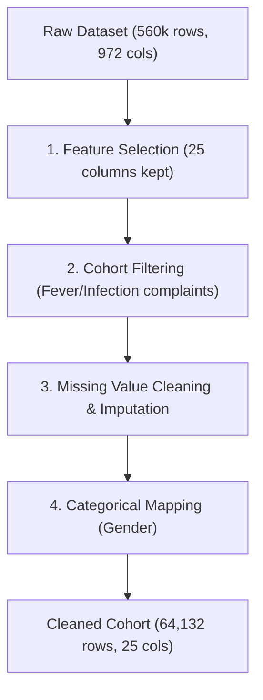

# Sahayak Triage — Data Extraction & Cleaning Guide

This guide provides a detailed walkthrough of the data extraction, cleaning, and preprocessing pipeline documented in **`notebooks/02_data_cleaning.ipynb`**. It explains the clinical and technical rationale behind each preprocessing step.

> 💡 **Related Document:** For the high-level system architecture, design choices, comparative trade-offs, and product roadmap, see **[Project Overview & Rationale](file:///c:/Users/sriji/Projects/Sahayak%20Triage/docs/project_overview_and_rationale.md)**.

---

## 1. Overview of the Cleaning Pipeline

The goal of the cleaning pipeline is to transform the raw Yale Emergency Department (ED) dataset into a clean, structured cohort of patients presenting with **fever and infection symptoms**, while ensuring that no post-triage information leaks into the features.

The cleaning pipeline follows these five core phases:



---

## 2. Step-by-Step Walkthrough

### Step 1: Pre-Extraction and Load
*   **Raw Data Size:** 560,486 patients and 972 columns.
*   **Problem:** Decompressing and parsing all 972 columns in a Jupyter notebook cell creates a severe memory bottleneck (requiring a ~3.14 GB contiguous allocation), leading to a `MemoryError`.
*   **Solution:** We pre-extract the 25 required columns (vitals, demographics, and target variables) into a smaller, memory-efficient raw CSV file (`data/raw/5v_cleandf_subset.csv`). This file loads instantly using standard pandas:
    ```python
    df = pd.read_csv("../data/raw/5v_cleandf_subset.csv")
    ```

---

### Step 2: Feature Selection (Preventing Target Leakage)
To build a reliable triage classifier, the model must **only** utilize information that is known at the moment the patient arrives at the triage desk.
*   **Target Leakage Risk:** The raw Yale dataset contains variables like `disposition` (whether the patient was admitted to the hospital), `admit_decision_time`, and post-triage test results. Including these would leak the final outcome to the model, artificially inflating training performance but rendering the model useless in the field.
*   **Whitelist Approach:** We strictly keep only three categories of variables:
    1.  **Target:** `esi` (Emergency Severity Index, 1 to 5).
    2.  **Demographics:** `age`, `gender`.
    3.  **Triage Vitals:** Temperature, Heart Rate, Respiratory Rate, O2 Saturation, Systolic BP, Diastolic BP.
    4.  **Chief Complaints:** Binary indicators (0/1) for 16 specific symptoms related to fever and infection.

---

### Step 3: Row Filtering (Cohort Isolation)
Not all 560,486 patients in the raw dataset had fever or infection. We isolate our target cohort by filtering for rows where **at least one** of the 16 fever or infection-related chief complaints is present (value = 1):

*   **Filter Condition:**
    ```python
    filter_condition = pd.Series(False, index=df.index)
    for col in fever_infection_cc:
        df[col] = pd.to_numeric(df[col], errors='coerce').fillna(0).astype(int)
        filter_condition = filter_condition | (df[col] == 1)
    df_filtered = df[filter_condition].copy()
    ```
*   **Result:** This isolates **64,308 patients** who presented with relevant symptoms.

---

### Step 4: Cleaning Target and Demographics
*   **Casting ESI:** We drop any rows missing the target variable `esi` (reducing the cohort to **64,132 patients**) and cast the ESI scores to integers.
*   **Gender Mapping:** The raw categorical text values are mapped to numeric values:
    *   `MALE` $\rightarrow$ `1`
    *   `FEMALE` $\rightarrow$ `0`
    *   Missing/Other $\rightarrow$ `-1`
*   **Age Imputation:** Missing age values are filled using the median age of the cohort.

---

### Step 5: Triage Vitals Cleaning and Imputation
Clinical vitals are often incomplete in fast-paced triage environments.
*   **Missing Rates in Vitals:**
    *   Heart Rate (HR): **34.34%** missing
    *   Systolic BP (SBP): **34.87%** missing
    *   Diastolic BP (DBP): **34.89%** missing
    *   Respiratory Rate (RR): **35.28%** missing
    *   Oxygen Saturation ($SpO_2$): **48.83%** missing
    *   Temperature (Temp): **37.07%** missing
*   **Imputation Strategy:**
    All missing values in the vitals columns are cast to float and imputed using the **median value** of the cohort:
    ```python
    for col in vital_cols:
        df_filtered[col] = pd.to_numeric(df_filtered[col], errors='coerce')
        median_val = df_filtered[col].median()
        df_filtered[col] = df_filtered[col].fillna(median_val)
    ```
*   **Clinical Justification:** Median imputation provides a stable baseline for vitals without introducing extreme outliers. For advanced machine learning, LightGBM handles missing data natively, but filling them ensures a standardized vector layout during pipeline inference.

---

## 3. The Output Dataset

The output is saved to **`data/processed/cleaned_triage_data.csv`** and contains **64,132 rows** and **25 columns**. It is a fully numeric, cleaned dataset ready for exploratory data analysis (EDA) and model training.

### Summary of Column Specifications

| Feature Name | Type | Range / Description | Clinical Importance |
| :--- | :--- | :--- | :--- |
| **`esi`** | Target (int) | `1` (Resuscitation) to `5` (Non-urgent) | Calibrated urgency classification |
| **`age`** | Numeric (float) | `0` to `100+` years | Risk factor (older age indicates higher risk) |
| **`gender`** | Binary (int) | `1` = Male, `0` = Female, `-1` = Unknown | Demographic covariate |
| **`triage_vital_hr`** | Numeric (float) | Heart Rate (bpm) | Tachycardia (>90 bpm) indicates SIRS/sepsis |
| **`triage_vital_sbp`** | Numeric (float) | Systolic Blood Pressure (mmHg) | Hypotension (<=100 mmHg) is a qSOFA danger sign |
| **`triage_vital_dbp`** | Numeric (float) | Diastolic Blood Pressure (mmHg) | Indication of perfusion pressure |
| **`triage_vital_rr`** | Numeric (float) | Respiratory Rate (breaths/min) | Tachypnea (>=22 bpm) is a qSOFA danger sign |
| **`triage_vital_o2`** | Numeric (float) | Oxygen Saturation ($SpO_2$ %) | Hypoxemia (<95%) indicates respiratory failure |
| **`triage_vital_temp`** | Numeric (float) | Temperature (°F) | Fever (>100.4°F) indicates active infection |
| **`cc_*`** | Binary (int) | `0` = Absent, `1` = Present | 16 symptoms (e.g. shortness of breath, cough) |
