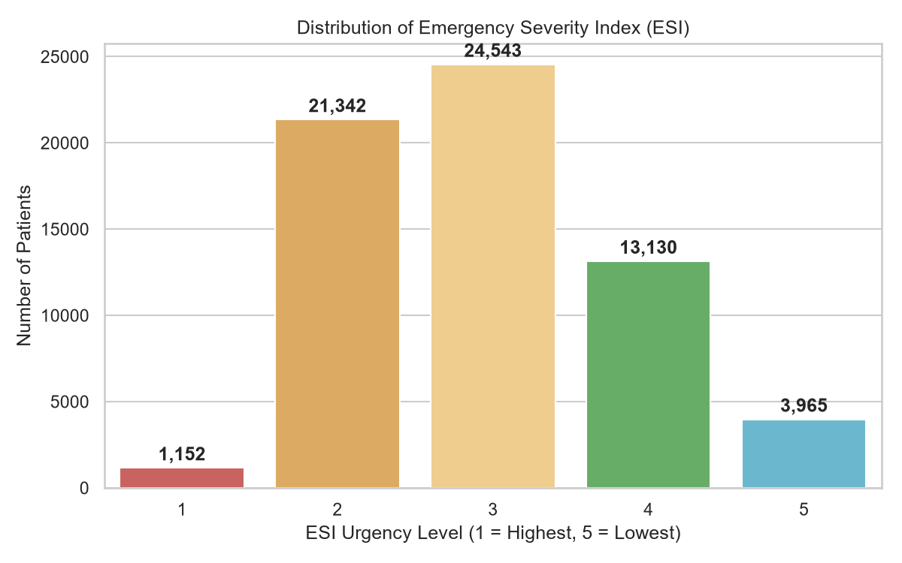
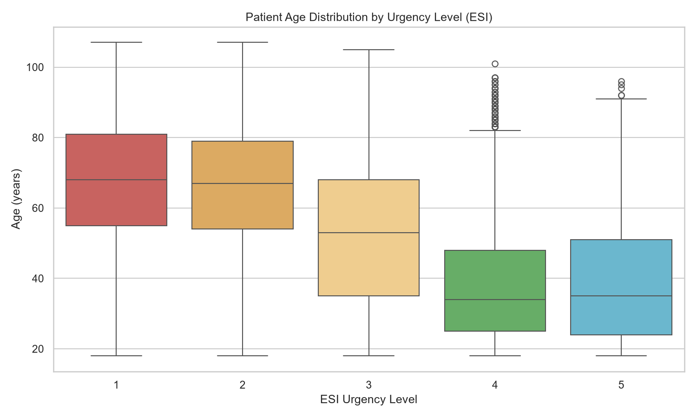
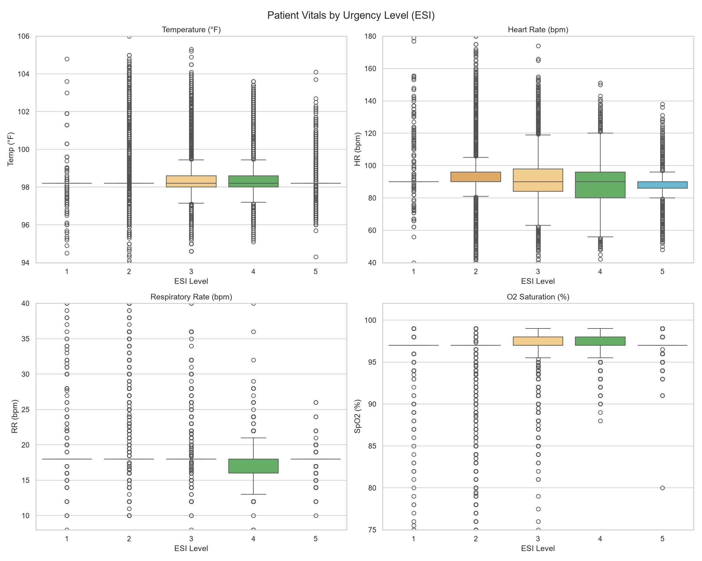
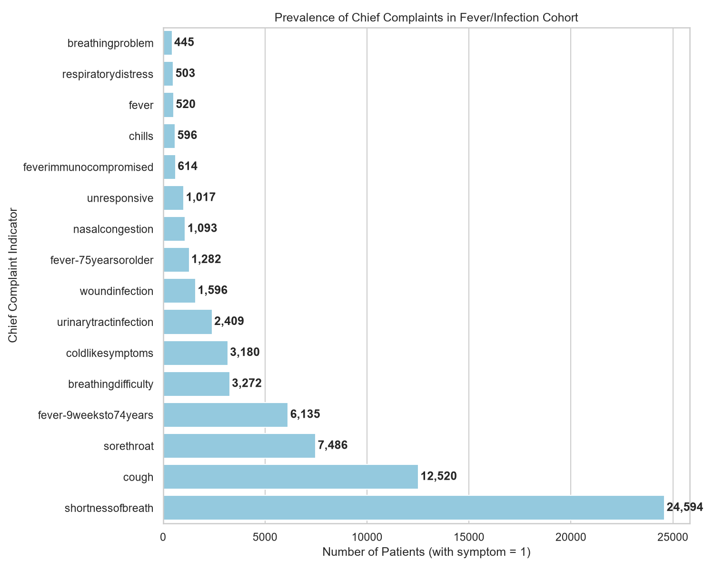
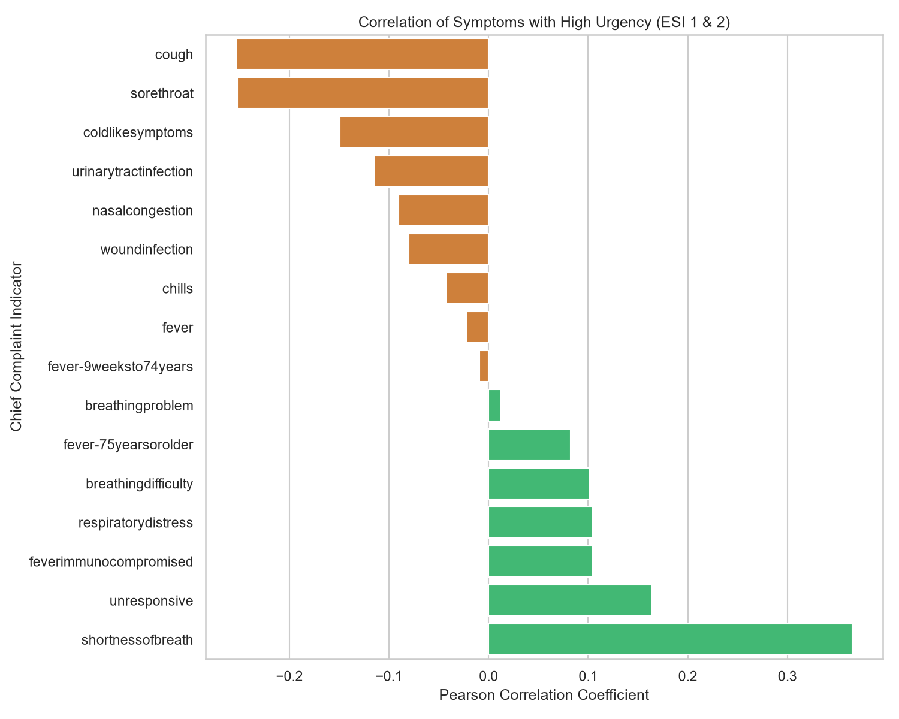

# Sahayak Triage — Dataset & Exploratory Data Analysis (EDA) Guide

This guide provides a comprehensive overview of the **Fever and Infection Triage Dataset** and a detailed walkthrough of the Exploratory Data Analysis (EDA) conducted in this project. It is designed to explain the clinical relevance of each feature and describe exactly how to interpret the generated charts.

> 💡 **Related Document:** For the high-level system architecture, design choices, comparative trade-offs, and product roadmap, see **[Project Overview & Rationale](file:///c:/Users/sriji/Projects/Sahayak%20Triage/docs/project_overview_and_rationale.md)**.

---

## 1. Introduction to the Dataset

The dataset represents a specialized cohort of patients presenting with **fever and infection symptoms**. It is derived from the **Yale Emergency Department (ED) Triage & Admission Dataset**, which contains real-world clinical records from March 2014 to July 2017.

*   **Total Patients in Cohort:** 64,132
*   **Total Features:** 24 input features + 1 target variable (`esi`)

### The Target Variable: Emergency Severity Index (ESI)
The target variable is `esi`, which is a standard 1 to 5 clinical scale used by triage nurses to score patient urgency:
*   **ESI 1 (Resuscitation):** Highest urgency. Patient requires immediate life-saving intervention (e.g., unresponsive, severe respiratory distress).
*   **ESI 2 (Emergent / High Risk):** High urgency. Patient is in a high-risk situation, confused/lethargic, or has severe pain/distress or abnormal vitals.
*   **ESI 3 (Urgent):** Medium urgency. Patient requires multiple resources (e.g., blood tests, IV fluids, X-rays) but has stable vitals.
*   **ESI 4 (Less Urgent):** Low urgency. Patient requires a single resource (e.g., a prescription or simple swab).
*   **ESI 5 (Non-Urgent):** Lowest urgency. Patient requires no resources (e.g., simple check-up or prescription refill).

---

## 2. Exploring the EDA Plots

Five key visualizations were generated to analyze the cohort. Below is a detailed breakdown of how to read each plot and the clinical insights we can extract from them.

### Plot 1: Distribution of Emergency Severity Index (ESI)

*   **What it represents:** A bar chart showing the total number and percentage of patients belonging to each of the 5 ESI urgency levels.
*   **Statistical Breakdown:**
    *   **ESI 1 (Highest):** 1,152 patients (**1.80%**)
    *   **ESI 2 (High):** 21,342 patients (**33.28%**)
    *   **ESI 3 (Medium):** 24,543 patients (**38.27%**)
    *   **ESI 4 (Low):** 13,130 patients (**20.47%**)
    *   **ESI 5 (Lowest):** 3,965 patients (**6.18%**)
*   **Key Insights:**
    *   The cohort is heavily dominated by **ESI 2** and **ESI 3** (over 71% combined). This represents the typical "gray area" of triage—patients who are clearly sick with an infection but whose progression to sepsis or severe illness requires careful scoring of vitals.
    *   **Class Imbalance:** ESI 1 represents only 1.80% of patients. During machine learning model training, we must handle this imbalance (using stratified splits and focusing on class-specific recall) to ensure our classifier does not miss these rare, critical patients.

---

### Plot 2: Patient Age Distribution by Urgency Level (ESI)

*   **What it represents:** A box plot showing the age range of patients assigned to each ESI level.
*   **How to read a box plot:**
    *   The **box** represents the Interquartile Range (IQR), containing the middle 50% of patients.
    *   The **horizontal line** inside the box represents the **median age**.
    *   The **whiskers** represent the range of the main body of data (typically 1.5 times the IQR).
*   **Median Age Findings:**
    *   **ESI 1:** Median age is **68.0 years**
    *   **ESI 2:** Median age is **67.0 years**
    *   **ESI 3:** Median age is **53.0 years**
    *   **ESI 4:** Median age is **34.0 years**
    *   **ESI 5:** Median age is **35.0 years**
*   **Key Insights:**
    *   There is a clear, positive relationship between age and urgency. Older patients (median age ~67–68) are far more likely to be classified as ESI 1 or ESI 2.
    *   Younger patients (median age ~34–35) dominate the lower urgency classes (ESI 4 and 5).
    *   **Clinical Reasoning:** Elderly patients presenting with fever and infection have significantly lower physiological reserve and are at a much higher risk of rapid deterioration (e.g., progressing to sepsis or severe pneumonia), which justifies their higher urgency classification.

---

### Plot 3: Patient Vitals by Urgency Level (ESI)

*   **What it represents:** A 2x2 grid of box plots showing how four critical vital signs vary across ESI levels:
    1.  **Temperature (°F)**
    2.  **Heart Rate (bpm)**
    3.  **Respiratory Rate (breaths/min)**
    4.  **Oxygen Saturation (SpO2 %)**
*   **Vitals Mean & Variance Analysis:**
    *   **Heart Rate (HR):** The mean HR is **91.9 bpm** for ESI 1 and **92.8 bpm** for ESI 2, dropping down to **88.2 bpm** for ESI 4 and **87.0 bpm** for ESI 5. Tachycardia (HR > 90) is a key diagnostic indicator of systemic inflammatory response syndrome (SIRS) and potential sepsis.
    *   **Respiratory Rate (RR):** The mean RR is highest for ESI 1 (**18.7 breaths/min**) and ESI 2 (**18.8 breaths/min**), with ESI 1 showing a high standard deviation (3.7 breaths/min). Tachypnea (RR >= 22) is one of the three critical qSOFA ( bedside sepsis-screening) criteria.
    *   **Oxygen Saturation (SpO2):** The mean SpO2 is lowest for ESI 2 (**96.22%**) and ESI 1 (**96.44%**), and rises to **97.38%** for ESI 4. Hypoxemia (low SpO2) indicates respiratory compromise, which immediately bumps a patient's urgency score.
    *   **Temperature:** Median temperatures remain stable around 98.2°F across the groups, but ESI 2 and ESI 3 show much wider standard deviations (~1.0°F), indicating patients with active spiking high fevers or hypothermia (both indicators of severe infection).

---

### Plot 4: Prevalence of Chief Complaints

*   **What it represents:** A horizontal bar chart showing how frequently each of the 16 filtered chief complaints (symptoms) appears in the cohort.
*   **Prevalence Figures:**
    *   **Shortness of Breath:** 24,594 patients (Most common symptom)
    *   **Cough:** 12,520 patients
    *   **Sore Throat:** 7,486 patients
    *   **Fever (9 weeks to 74 years):** 6,135 patients
    *   **Breathing Difficulty:** 3,272 patients
    *   **Unresponsive (Altered Mental Status):** 1,017 patients (Critical danger sign)
    *   **Fever in Immunocompromised:** 614 patients
*   **Key Insights:**
    *   Respiratory complaints (shortness of breath, cough, breathing difficulty) dominate the fever and infection cohort.
    *   Critical danger signs like an **unresponsive** state or **immunocompromised fever** are less common but represent high-risk cases that require immediate detection.

---

### Plot 5: Correlation of Symptoms with High Urgency (ESI 1 & 2)

*   **What it represents:** A bar chart showing the Pearson correlation coefficient between each symptom and whether a patient is classified as high-urgency (ESI 1 or ESI 2).
    *   **Green bars (Positive values):** Symptoms that are positively associated with high urgency (more likely to be ESI 1 or 2).
    *   **Orange bars (Negative values):** Symptoms that are negatively associated with high urgency (more likely to be ESI 4 or 5).
*   **Clinical Interpretation:**
    1.  **High Urgency Drivers (Green):**
        *   `shortnessofbreath` (**+0.3649** correlation)
        *   `unresponsive` (**+0.1641**)
        *   `feverimmunocompromised` (**+0.1046**)
        *   `respiratorydistress` (**+0.1043**)
        *   `breathingdifficulty` (**+0.1015**)
        *   *Clinical Meaning:* These complaints represent severe respiratory failure or central nervous system depression (signs of severe sepsis/hypoxemia), which are major clinical red flags requiring immediate hospital care.
    2.  **Low Urgency Drivers (Orange):**
        *   `cough` (**-0.2536** correlation)
        *   `sorethroat` (**-0.2521**)
        *   `coldlikesymptoms` (**-0.1492**)
        *   `nasalcongestion` (**-0.0907**)
        *   *Clinical Meaning:* While cough and sore throat are common in patients with a fever, they are strongly correlated with localized, self-limiting upper respiratory tract infections (like the common cold or mild flu) rather than severe systemic infection. Therefore, they negatively correlate with emergent classification.

---

## 3. Data Quality and Missing Values

When analyzing clinical triage data in the real world, missing records are highly common.
*   **Vitals Missing Rates:** In the raw dataset, heart rate, blood pressure, respiratory rate, and temperature are missing in **34% to 37%** of patients.
*   **Oxygen Saturation (SpO2) Missing Rate:** SpO2 is missing in **48.83%** of cases.
*   **Imputation Strategy:** In the cleaning step (`src/data_cleaning.py`), these missing values are imputed using the **median** values of the cohort.
*   **Model Advantage:** The LightGBM classifier used in this project handles missing values natively, but imputing them guarantees a clean, standard input format for clinical decision support.
