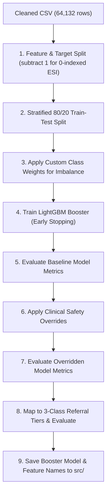

# Sahayak Triage — Model Training & Evaluation Guide

This guide provides a detailed walkthrough of the model training, evaluation, and clinical override logic documented in **`notebooks/03_model_training.ipynb`**. It explains the technical choices, hyperparameters, clinical overrides, and the results of the evaluation.

---

## 1. Overview of the Model Training Pipeline

The training pipeline loads the cleaned CSV from the data preparation phase, splits the features and target variable, trains a LightGBM multi-class classifier using custom class weights, overlays clinical safety heuristics, and evaluates the final hybrid system.



---

## 2. Technical Decisions & Hyperparameters

### Handling Class Imbalance
The primary challenge of this dataset is extreme class imbalance. ESI 1 (Highest Urgency) represents only **1.8%** of the patients. A standard machine learning model trained on this data would optimize for overall accuracy by ignoring the rare ESI 1 class, which is clinically unacceptable.

To force the model to focus on high-urgency cases, we define **custom class weights** during training:
*   **ESI 1 (Class 0):** Weight = `10.0` (highest penalty for misclassification)
*   **ESI 2 (Class 1):** Weight = `2.0`
*   **ESI 3 (Class 2):** Weight = `1.0`
*   **ESI 4 (Class 3):** Weight = `1.0`
*   **ESI 5 (Class 4):** Weight = `2.0` (increased to separate non-urgent from urgent)

These weights are applied as sample weights to the LightGBM dataset:
```python
custom_weights = {0: 10.0, 1: 2.0, 2: 1.0, 3: 1.0, 4: 2.0}
sample_weight = y_train.map(custom_weights).values
train_data = lgb.Dataset(X_train, label=y_train, weight=sample_weight)
```

### LightGBM Model Hyperparameters
We choose LightGBM for its high training speed, native handling of missing values, and excellent classification performance.
*   **Objective:** `multiclass` (5-class classification)
*   **Boosting Type:** `gbdt` (Gradient Boosting Decision Tree)
*   **Learning Rate:** `0.03`
*   **Num Leaves:** `31` (prevents overfitting on small clusters)
*   **Max Depth:** `6` (restricts tree depth to control model complexity)
*   **Feature Fraction:** `0.8` (uses 80% of features randomly per tree, adding robustness)
*   **Min Child Samples:** `50` (prevents creating leaves with too few samples)
*   **Early Stopping:** 50 rounds (validates against the test set to stop training when log loss stops decreasing)

---

## 3. Clinical Safety Overrides

To bridge the gap between machine learning patterns and clinical safety, we implement a post-processing override layer. If a patient's vitals or symptoms match specific high-risk clinical conditions, the ML prediction is upgraded to a higher urgency tier, regardless of what the LightGBM classifier predicted.

### ESI 1 Overrides (Immediate Life-Saving Intervention)
A patient is upgraded to ESI 1 (Class 0) if they meet **any** of the following criteria:
1.  **Unresponsive / Altered Mental Status:** `cc_unresponsive == 1`
2.  **Severe Respiratory Distress:** `cc_respiratorydistress == 1`
3.  **Severe Hypoxia:** Oxygen saturation ($SpO_2$) $< 90\%$

### ESI 2 Overrides (Emergent)
A patient is upgraded to ESI 2 (Class 1) if they meet **any** of the following high-risk conditions and the ML prediction was lower urgency (ESI 3, 4, or 5):
1.  **High-Risk Sepsis Profile (qSOFA $\ge 2$):** Patient triggers at least two bedside sepsis-screening criteria:
    *   Respiratory rate $\ge 22$ breaths/min
    *   Systolic blood pressure $\le 100$ mmHg
    *   Unresponsive/altered mental status
2.  **Moderate Hypoxia:** Oxygen saturation ($SpO_2$) $< 95\%$
3.  **Extreme Temperature:** Body temperature $> 104^\circ\text{F}$ (hyperpyrexia) or $< 95^\circ\text{F}$ (hypothermia)

---

## 4. Evaluation Results & Interpretation

The model was evaluated on a test set containing **12,827 patients** ($20\%$ of the cohort).

### Phase A: Baseline Model (No Overrides)
The baseline model achieves high recall on ESI 2 but misses many critical ESI 1 emergencies.
*   **Overall Accuracy:** **`60.60%`**
*   **Recall on ESI 1 (Highest Urgency):** **`53.04%`**
*   **Recall on ESI 2 (High Urgency):** **`84.68%`**

```
Classification Report (Baseline):
              precision    recall  f1-score   support

       ESI 1       0.46      0.53      0.49       230
       ESI 2       0.61      0.85      0.71      4269
       ESI 3       0.64      0.41      0.50      4909
       ESI 4       0.65      0.61      0.63      2626
       ESI 5       0.42      0.54      0.47       793
```

---

### Phase B: Model with Clinical Overrides (ML + Heuristics)
Applying clinical overrides successfully boosts safety-critical recall on the most urgent patients.
*   **Overall Accuracy:** **`58.36%`** ($2.24\%$ decrease due to safety-first shifts)
*   **Recall on ESI 1 (Highest Urgency):** **`58.70%`** ($+5.66\%$ improvement in catching life-threatening cases)
*   **Recall on ESI 2 (High Urgency):** **`80.82%`**
*   **Overridden Predictions:** `454` cases ($3.54\%$ of the test set)

```
Classification Report (With Clinical Overrides):
              precision    recall  f1-score   support

       ESI 1       0.27      0.59      0.37       230
       ESI 2       0.58      0.81      0.68      4269
       ESI 3       0.64      0.38      0.48      4909
       ESI 4       0.65      0.61      0.63      2626
       ESI 5       0.42      0.54      0.47       793
```
> [!NOTE]
> **Understanding the Trade-off:** While ESI 1 precision dropped from `0.46` to `0.27`, this is desired clinical behavior. In triage, false alarms (lower precision) are acceptable if it means we miss fewer critical patients (higher recall).

---

### Phase C: Hybrid Model on 3-Class Referral Tiers
For rural health workers, 5 distinct classes are mapped to 3 actionable referral categories:
*   **High Urgency (ESI 1-2):** Refer immediately.
*   **Medium Urgency (ESI 3):** Refer for assessment.
*   **Low Urgency (ESI 4-5):** Routine consultation / Home monitoring.

*   **3-Class Tier Accuracy:** **`65.93%`**
*   **Recall on High Urgency (ESI 1-2):** **`89.0%`** (highly safe for escalation workflows)
*   **Precision on High Urgency (ESI 1-2):** **`62.0%`** (manageable alert load)

```
Classification Report (3-Class Tiers):
                        precision    recall  f1-score   support

High Urgency (ESI 1-2)       0.62      0.89      0.73      4499
Medium Urgency (ESI 3)       0.64      0.38      0.48      4909
 Low Urgency (ESI 4-5)       0.75      0.75      0.75      3419
```

---

## 5. Model Artifacts

The final trained artifacts are exported to the **`src/`** directory for real-time inference:
1.  **`src/triage_model.txt`:** The saved LightGBM Booster model, containing tree rules.
2.  **`src/feature_columns.pkl`:** A pickle file saving the list of 31 features in their exact training column order, ensuring data passed at inference matches the model expectations.
