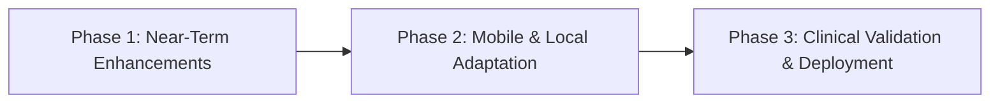

# Sahayak Triage — Project Overview, Architecture & Technical Rationale

**AI-Assisted Fever & Infection Triage Decision Support for Frontline Health Workers**

---

## 1. Executive Summary & Core Motivation

In rural healthcare settings across India, Accredited Social Health Activist (**ASHA**) and Auxiliary Nurse Midwife (**ANM**) workers serve as the primary point of contact for millions of patients. When a patient presents with fever or infection symptoms in a village sub-centre, the worker faces a high-stakes decision under severe constraints:

- **Resource Constraints:** Primary Health Centres (PHCs) or district hospitals may be hours away by road.
- **Task Overload & Uncertainty:** Frontline workers manage fragmented paper records, heavy workloads, and varied patient presentations without immediate physician consultation.
- **Decision Clarity:** The essential clinical question at the point of care is **not** "What exact pathogen or disease does this patient have?" but rather **"Given these symptoms and vitals, how urgently does this patient need referral to a higher-level facility?"**

**Sahayak Triage** is built specifically to answer this narrow, high-stakes question. It is designed from the ground up as a **calibrated clinical decision-support tool**, not a diagnostic system. It estimates patient urgency (Emergency Severity Index, ESI levels 1–5 mapped to 3 referral tiers), surfaces top contributing physiological factors via SHAP explanations, cites grounded clinical guidelines (RAG), and formats clear plain-language advice.

---

## 2. System Architecture & Problem Solution

The core architectural principle of Sahayak Triage is **modular separation of concerns**. Rather than relying on a single end-to-end model, the system divides triage into five distinct, specialized components:

```
[ Patient Intake Form ] (Demographics, Vitals, 16 Chief Complaints)
        │
        ▼
┌─────────────────────────────────────────────────────────┐
│ 1. LightGBM Classifier                                  │
│    Calculates baseline statistical ESI probabilities &  │
│    extracts SHAP feature attributions                  │
└──────────────────────────┬──────────────────────────────┘
                           │
                           ▼
┌─────────────────────────────────────────────────────────┐
│ 2. Clinical Safety Overrides                            │
│    Applies qSOFA, SIRS, and Hypoxia heuristics;         │
│    can ONLY escalate urgency tier                       │
└──────────────────────────┬──────────────────────────────┘
                           │
                           ▼
┌─────────────────────────────────────────────────────────┐
│ 3. Guideline Retrieval (Hybrid RAG)                     │
│    Combines rule matching + local sentence-transformer  │
│    embeddings over a 10-guideline corpus                │
└──────────────────────────┬──────────────────────────────┘
                           │
                           ▼
┌─────────────────────────────────────────────────────────┐
│ 4. LLM Formatter (Groq → Gemini → Offline Template)    │
│    Strictly constrained text formatting layer           │
│    Never diagnoses or invents clinical detail          │
└──────────────────────────┬──────────────────────────────┘
                           │
                           ▼
[ Streamlit UI ] (Glassmorphic cards, ESI Dial, Vitals Badges, SHAP Bars)
```

### Component Responsibilities:
1. **LightGBM Classifier:** Learns complex, non-linear multi-variable patterns across age, vitals, and chief complaints from tens of thousands of historical patient records.
2. **Clinical Safety Overrides:** Enforces absolute clinical safety rules (e.g., $SpO_2 < 90\%$ or qSOFA score $\ge 2$). Overrides act as a one-way ratchet: they can upgrade a low-urgency prediction to a critical tier, but can never downgrade an urgent prediction.
3. **Guideline Retrieval (Hybrid RAG):** Grounds every triage decision in real, citable clinical protocols (WHO IMCI, qSOFA, SIRS) using both rule-based triggers and CPU-friendly local vector search (`all-MiniLM-L6-v2`).
4. **LLM Formatter Layer:** Rephrases structured outputs into concise, empathetic recommendations. It operates under strict system prompt constraints: **it formats only, never diagnoses, and never predicts prognosis.**
5. **Streamlit UI:** Provides zero-click real-time recalculation, visual vitals status badges, an interactive ESI scale dial, and readable SHAP explanation bars.

---

## 3. Comparative Analysis: Why Other Approaches Were Rejected

When designing a clinical decision support tool for low-resource environments, several alternative architectures were evaluated. Below is a detailed breakdown of why alternative solutions were rejected in favor of Sahayak Triage's hybrid pattern.

| System Pattern | Proposed / Existing Alternative | Sahayak Triage Choice | Why the Alternative Was Rejected |
| :--- | :--- | :--- | :--- |
| **Conversational AI / Free-Text Chatbots** | **ASHABot / eSanjeevani / Raw GPT-4** (Free-text prompt $\rightarrow$ free-text response) | **Structured Intake $\rightarrow$ Calibrated Numeric Urgency Score** | **1. Hallucination Risk:** Generative LLMs can invent diagnoses or omit critical danger signs.<br>**2. No Numerical Calibration:** Free text cannot output a validated ESI 1–5 urgency score.<br>**3. High Latency & Cost:** Requires active internet and expensive API calls.<br>**4. Auditability:** Impossible to deterministically verify why a chatbot gave a specific answer. |
| **Pure Unconstrained Machine Learning** | **XGBoost / RandomForest / LightGBM Classifier Alone** | **LightGBM + Deterministic Clinical Safety Overrides** | **1. Missed Edge Cases:** Pure statistical models can misclassify severe cases if vitals are noisy or sparse.<br>**2. Lack of Hard Safety Bounds:** A model might predict ESI 3 for a patient with $SpO_2 = 88\%$ if other symptoms appear mild. Overrides guarantee zero false negatives for defined danger signs. |
| **Pure Rule-Based Expert Systems** | **Clinical Flowcharts / Decision Tree Algorithms Only** | **Hybrid ML + Heuristic Overrides** | **1. High Brittleness:** Hardcoded rules fail in complex "gray-zone" patients (e.g., ESI 2 vs ESI 3) where vitals are slightly abnormal across multiple axes.<br>**2. Inflexible Escalation:** Cannot weight complex multi-variable interactions or adapt to cohort-level statistical patterns. |
| **Deep Learning & Multimodal LLMs** | **ClinicalBERT / Med-PaLM / Dense Neural Networks** | **LightGBM + Local Sentence Transformers** | **1. Resource Footprint:** Requires GPU infrastructure for inference, making edge/offline deployment impossible.<br>**2. Data Hunger:** Deep networks overfit on tabular clinical vitals datasets compared to gradient-boosted trees.<br>**3. Low Explainability:** Feature attribution (SHAP) is faster and more reliable on trees than deep nets. |

---

## 4. Industry Readiness Assessment: Drawbacks & Limitations

While Sahayak Triage demonstrates high clinical safety and explainability, **it is currently a decision-support prototype and is NOT ready for unmonitored production deployment.** The following key limitations must be addressed before real-world clinical integration:

### A. Dataset & Geographic Domain Shift
- **US Cohort Origin:** The model is trained on de-identified Emergency Department records from Yale New Haven Health (2014–2017).
- **Domain Shift:** Demographic profiles, baseline co-morbidities, and disease prevalence in a US tertiary emergency room differ significantly from rural Indian primary care cohorts (e.g., endemic malaria, dengue, typhoid, or malnutrition baseline).

### B. ESI 1 Precision Trade-Off (False Alarm Rate)
- **Class Imbalance:** ESI 1 (resuscitation cases) comprises only **1.80%** of the training cohort.
- **Precision vs Recall:** To protect patient safety, custom class weighting ($10\times$ penalty for ESI 1) and safety overrides were introduced. This increased ESI 1 recall from **53.04% to 58.70%**, but dropped ESI 1 precision to **0.27**.
- **Impact:** Nearly 7 out of 10 ESI 1 alerts are false alarms. While clinically preferred over missing a fatal emergency, high false-alarm rates can lead to "alarm fatigue" among health workers.

### C. Vitals Imputation Strategy
- **Median Imputation:** Missing vitals (up to 48% missing for $SpO_2$) are currently imputed using cohort medians.
- **Drawback:** Median imputation treats missing vitals independently and does not preserve physiological relationships (e.g., correlation between high temperature and elevated heart rate).

### D. Guideline Corpus & Language Support
- **Corpus Size:** The retrieval engine currently indexes a curated 10-entry guideline corpus. It does not yet encompass full WHO IMCI manuals or complete Indian Ministry of Health & Family Welfare (MOHFW) guidelines.
- **Language Localization:** Hindi support in the current UI is limited to static keyphrases rather than dynamic full-text translation.

### E. Clinical & Regulatory Certification
- **SaMD Compliance:** The platform has not undergone formal Software as a Medical Device (SaMD) regulatory evaluation or prospective clinical trial validation under CDSCO / ICMR guidelines.

---

## 5. Technical Roadmap & Future Improvements

To transition Sahayak Triage from a hackathon prototype to an industry-ready clinical platform, the following multi-phase roadmap is planned:



### Phase 1: Near-Term Enhancements (Model & Data Pipeline)
1. **Advanced Imputation Methods:** Replace median imputation with K-Nearest Neighbors (KNN) or MICE (Multivariate Imputation by Chained Equations) to preserve vital sign relationships.
2. **Dynamic Confidence Threshold Tuning:** Refine the $45\%$ confidence threshold escalation rule to optimize the precision-recall boundary for ESI 2 and ESI 3 tiers.
3. **Session Audit Logging:** Implement lightweight, privacy-preserving session logging of raw inputs, triggered overrides, and retrieved guidelines for clinical post-audit reviews.

### Phase 2: Mobile & Regional Adaptation (Edge Architecture)
1. **Indian Rural Cohort Transfer Learning:** Fine-tune the LightGBM booster using a prospective dataset gathered from Indian rural Primary Health Centres (PHCs).
2. **Offline Mobile Application (Android / PWA):** Package the LightGBM model into ONNX/TFLite format and embed the sentence transformer model into a lightweight, offline Android app running on standard low-cost smartphones.
3. **Expanded Guideline Corpus:** Expand the vector database to cover the full WHO IMCI (Integrated Management of Childhood Illness) handbook and national sepsis/fever management guidelines.

### Phase 3: Clinical Validation & Human-AI Integration
1. **Multilingual Voice Interface:** Integrate lightweight offline Speech-to-Text (e.g., Whisper-small/Indic-STT) to allow hands-free voice input in Hindi and regional languages for busy ASHA workers.
2. **Prospective Shadow Clinical Trial:** Conduct shadow testing alongside certified ANM nurses at PHC facilities to evaluate real-world decision agreement, task speed, and health worker satisfaction.
